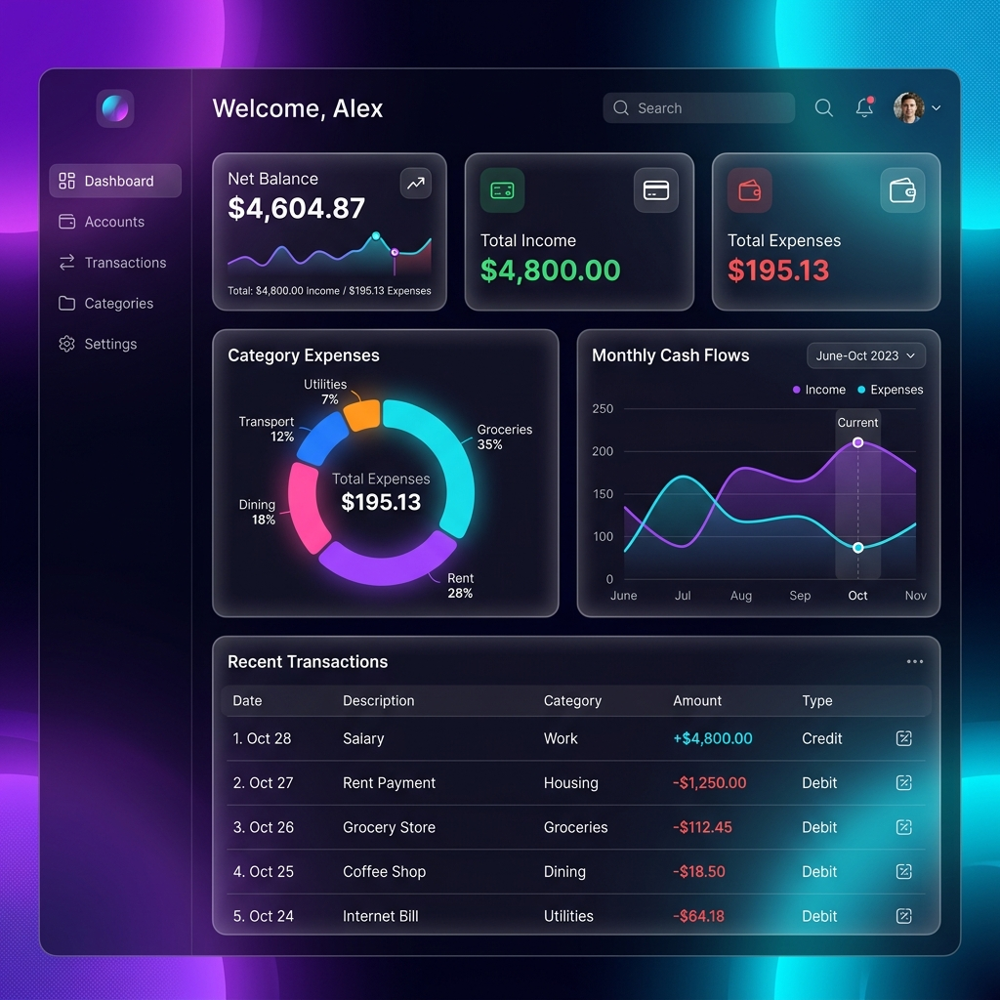

# Expense Tracker App



Expense Tracker is a highly polished, responsive expense tracking dashboard built with **HTML**, **Vanilla CSS**, **JavaScript (ES6)**, and a **Python (Flask)** backend with a **SQLite** database.

## Features
- **Dashboard Summary**: Real-time balance, income, and expense cards.
- **Data Visualization**:
  - Interactive categories breakdown doughnut chart (using Chart.js).
  - Cash flow trends line chart detailing monthly incomes vs expenses.
- **Complete CRUD Operations**: Create, read, update, and delete transaction history dynamically.
- **Search & Filter Controls**: Live-search titles and filter by transaction type or category.
- **Dynamic Category Swapping**: Form categories swap depending on whether you choose Income or Expense.
- **Premium Aesthetics**: Clean dark mode layout, frosted-glass effects (glassmorphism), subtle gradients, glowing indicators, responsive design, and smooth animations.

---

## Installation & Setup

### Prerequisites
- Python 3.8 or above installed on your system.

### Step 1: Install Dependencies
Open your terminal in this project directory and install the necessary package (`Flask`):
```bash
pip install -r requirements.txt
```

### Step 2: Run the Application
Start the Flask local development server:
```bash
python app.py
```

By default, Flask will run on **`http://127.0.0.1:5000`**.

### Step 3: Open in Browser
Open your web browser and navigate to:
[http://localhost:5000](http://localhost:5000)

The application database `expenses.db` will be initialized automatically with beautiful mock seed transactions so the charts and history load populated on the first boot.
